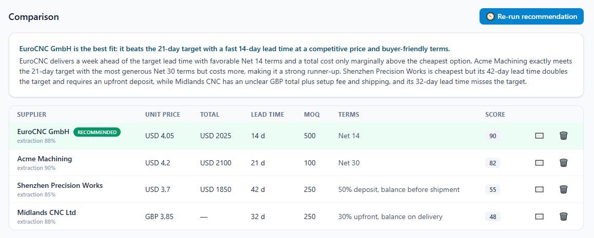
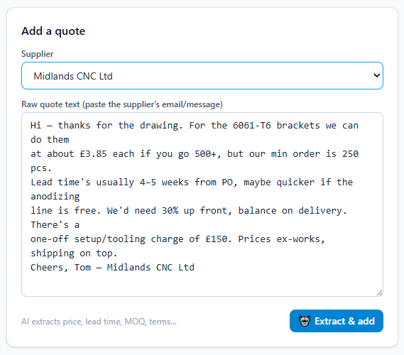
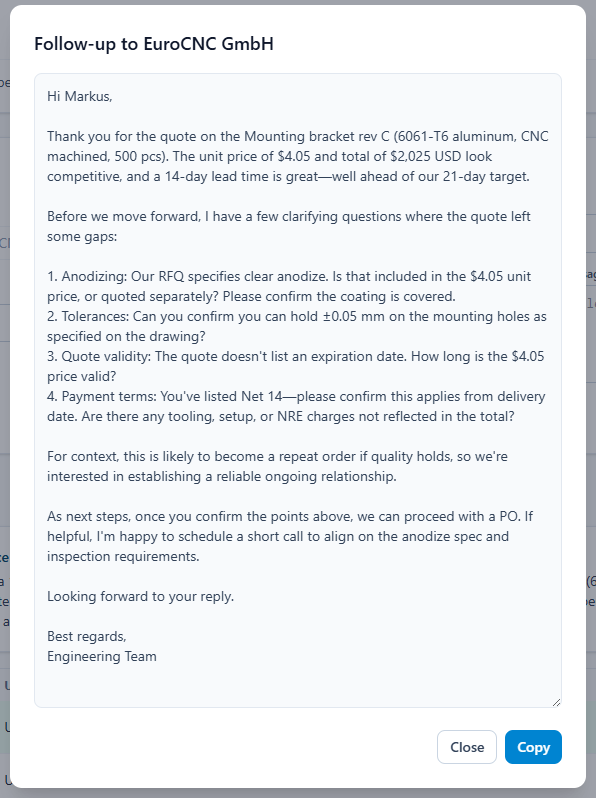
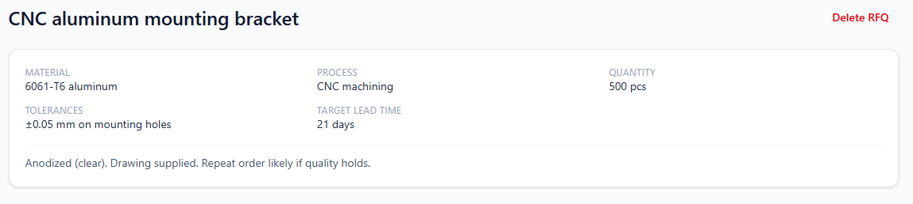

# 🧭 QuoteCompass

**Turn messy supplier quotes into structured, comparable data — with AI.**

QuoteCompass is a full-stack app for hardware/manufacturing sourcing. An engineer creates a
Request for Quote (RFQ), pastes in the free-text quotes suppliers send back, and an LLM:

1. **Extracts** structured fields from each messy quote (price, lead time, MOQ, terms…)
2. **Recommends** the best option across all quotes with plain-English reasoning
3. **Drafts** a follow-up email to any supplier.

> **Live demo:** **[quote-compass.vercel.app](https://quote-compass.vercel.app)** · **Bring your own Anthropic API key** (stored only in your browser).

---

## Walkthrough

<!-- Optional hero GIF: record the full flow (~6–8s) and drop it here for the strongest first impression.
<p align="center"></p>
-->

**1. Compare every quote at a glance — with an AI recommendation.**
Claude ranks each supplier 0–100 against the RFQ (price *and* lead time *and* MOQ), highlights the best row, and explains why in plain English.



**2. Paste the messy quote suppliers actually send.**
Free-text email in — different currencies, "3–4 weeks" lead times, MOQs buried in a sentence. Claude extracts validated, structured fields with a confidence score.



**3. Draft a follow-up in one click.**
Generate a professional email to any supplier — ready to review and send.



**4. It all starts from a structured RFQ.**
Capture the part, material, process, quantity and target lead time that every quote is compared against.



---

## Why this project

Real supplier quotes arrive as unstructured emails — different currencies, "3–4 weeks" lead
times, MOQs buried in a sentence, sometimes in another language. Comparing them by hand is slow
and error-prone. QuoteCompass models that domain properly and uses a **multi-step LLM workflow**
to do the tedious part, so the engineer can decide.

---

## Features

- 📝 **RFQ management** — capture part, material, process, quantity, tolerances, target lead time.
- 🤖 **AI extraction** — paste a raw quote; Claude returns validated, structured fields with a
  self-reported confidence score.
- 📊 **Side-by-side comparison** — a clean table across suppliers, with the recommended row highlighted.
- 🧭 **AI recommendation** — ranks every quote (0–100) with pros/cons and a headline verdict that
  weighs price *and* lead time *and* MOQ against the actual RFQ.
- ✉️ **AI-drafted follow-ups** — one click generates a professional email to a supplier.
- 🔑 **Bring-your-own-key** — your Anthropic key lives only in your browser and is sent per request;
  it never hits the database.
- 🧪 **One-click sample data** — explore a fully worked example instantly.

---

## Architecture

```
┌─────────────────────────┐        /api (x-session-id, x-llm-key)        ┌─────────────────────────────┐
│   React + TypeScript    │  ────────────────────────────────────────▶     Node.js + Express (TS)
│   Vite · Tailwind       │                                                REST API
│   (Vercel)              │  ◀───────────────────────────────────────     (Render)
└─────────────────────────┘                  JSON                        └───────────────┬─────────────┘
                                                                                         │
                                                        ┌────────────────────────────────┼────────────────────┐
                                                        │                                │                    │
                                                 ┌──────▼──────┐              ┌──────────▼─────────┐          │
                                                 │  MongoDB    │              │ Claude (Anthropic) │          │
                                                 │  (Atlas)    │              │ structured outputs │          │
                                                 │  Mongoose   │              │ BYO key per request│          │
                                                 └─────────────┘              └────────────────────┘          │
                                                                                                              │
                                       Multi-step LLM workflow:  extract ──▶ recommend ──▶ draft ────────────┘
```

**Data model:** `RFQ` → many `Quotes` → each references a `Supplier`. All records are scoped by a
per-browser `sessionId` so public-demo visitors never collide.

**The LLM layer** ([`server/src/services`](server/src/services)) is three focused Claude calls:
- `extractQuote` and `recommend` use **structured outputs** (Zod schema → guaranteed JSON).
- `draftFollowUp` returns free-form text.
- The model is set in one place ([`llm.ts`](server/src/services/llm.ts)) and the API key is supplied
  per request — nothing is stored server-side.

---

## Tech stack

| Layer     | Tech                                                            |
| --------- | -------------------------------------------------------------- |
| Frontend  | React 19, TypeScript, Vite, Tailwind CSS, React Router          |
| Backend   | Node.js, Express 5, TypeScript, Zod                             |
| Database  | MongoDB (Atlas) via Mongoose                                    |
| AI        | Claude (`@anthropic-ai/sdk`) with structured outputs           |
| Deploy    | Vercel (frontend) · Render (API) · MongoDB Atlas (DB)          |

---

## Running locally

**Prerequisites:** Node 20+, and a MongoDB connection string (local `mongod` or a free
[MongoDB Atlas](https://www.mongodb.com/atlas) cluster).

```bash
# 1. API
cd server
cp .env.example .env          # set MONGODB_URI
npm install
npm run seed                  # optional: load sample data into a "demo" session
npm run dev                   # http://localhost:4000

# 2. Web app (in a second terminal)
cd client
npm install
npm run dev                   # http://localhost:5173  (proxies /api → :4000)
```

Open the app, click **Add API key** and paste an
[Anthropic API key](https://console.anthropic.com/settings/keys), then **Load sample data**.

---

## Deploying

- **Database** — create a free MongoDB Atlas cluster; copy its connection string.
- **API (Render)** — new Web Service from `server/`: build `npm install && npm run build`,
  start `npm start`, set `MONGODB_URI` and `CORS_ORIGIN` (your Vercel URL).
- **Frontend (Vercel)** — import `client/`, set `VITE_API_BASE` to the Render URL. Vite build.

---

## Project structure

```
quote-compass/
├── client/                  # React + Vite frontend
│   └── src/
│       ├── components/      # UI: comparison table, forms, dialogs
│       ├── pages/           # RFQ list & detail
│       └── lib/             # API client, session/key, formatting
└── server/                  # Express + TypeScript API
    └── src/
        ├── models/          # Mongoose schemas (RFQ, Supplier, Quote)
        ├── routes/          # REST endpoints
        ├── services/        # LLM workflow + sample data
        └── middleware/      # session scoping, errors
```

---

_Built as a portfolio project to demonstrate full-stack product engineering with React, Node.js,
MongoDB, and applied LLMs._
